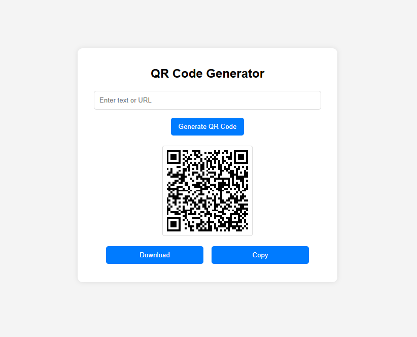

# qr-code-generator

This open-source project allows users to easily generate QR codes using a simple and responsive web interface.

## Demo

Check out the live demo: [QR Code Generator](https://msilabs.github.io/qr-code-generator/)

## Screenshots

## Features

- **User-Friendly:** Intuitive interface for seamless usage.
- **Responsive Design:** Works flawlessly on both mobile and desktop devices.
- **Free & Open Source:** Open for everyone to use and contribute.

## Prerequisites

To run this project, ensure you have:
- A modern web browser (e.g., Chrome, Firefox, Edge)
